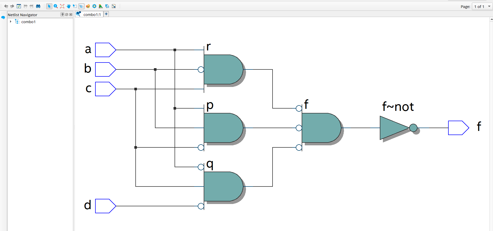
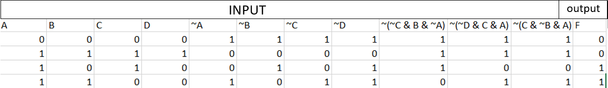
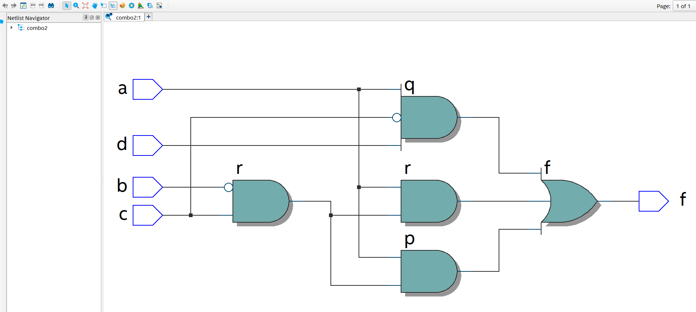
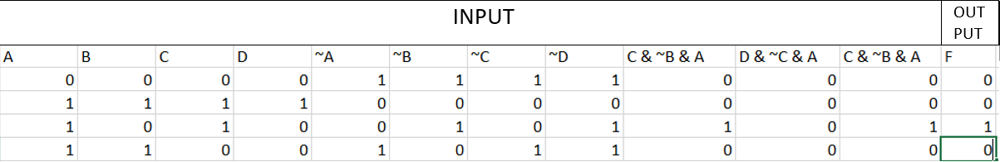

# Experiment--02-Implementation-of-combinational-logic-gates
Implementation of combinational logic gates
 
## AIM:
To implement the given logic function verify its operation in Quartus using Verilog programming.
 F1= A’B’C’D’+AC’D’+B’CD’+A’BCD+BC’D
F2=xy’z+x’y’z+w’xy+wx’y+wxy
 
 
 
## Equipments Required:
## Hardware – PCs, Cyclone II , USB flasher
## Software – Quartus prime

## Theory
Logic gates are electronic circuits which perform logical functions on one or more inputs to produce one output.
## Using NAND gates
NAND gate is actually a combination of two logic gates i.e. AND gate followed by NOT gate. So its output is complement of the output of an AND gate.This gate can have minimum two inputs, output is always one. By using only NAND gates, we can realize all logic functions: AND, OR, NOT, X-OR, X-NOR, NOR. So this gate is also called as universal gate. First note that the entire expression is inverted and we have three terms ANDed. This means that we must use a 3-input NAND gate. Each of the three terms is, itself, a NAND expression. Finally, negated single terms can be generates with a 2-input NAND gate acting as an inverted.

F=((C'.B.A)'(D'.C.A)'(C.B'.A)')'

## Procedure
1.Create a project with required entities.

2.Create a module along with respective file name.

3.Run the respective programs for the given boolean equations.

4.Run the module and get the respective RTL outputs.

5.Create university program(VWF) for getting timing diagram.

6.Give the respective inputs for timing diagram and obtain the results.

## Program:
/*
Program to implement the given logic function and to verify its operations in quartus using Verilog programming.
Developed by: Jeeva Abishake
RegisterNumber:  212221240018
*/
### Using NAND:
   module combo1(a,b,c,d,f);
   input a,b,c,d;
   output f;
   wire p,q,r;
   assign p=(~c & b & a);
   assign q=(~d & c & ~a);
   assign r=(c & ~b & a);
   assign f=(~(~p & ~q & ~r));
   endmodule
### Using NOR:
    module combo2(a,b,c,d,f);
   input a,b,c,d;
   output f;
   wire p,q,r;
   assign p=( c & ~b & a);
   assign q=( d & ~c & a);
   assign r=( c & ~b & a);
   assign f=(~(~( p | q | r)));
   endmodule
   

## Output:
## Using NAND:
## RTL:

## Timing Diagram:

## Truth Table:

## Using NOR:
## RTL:

## Timing Diagram:

## Truth Table:

## Result:
Thus the given logic functions are implemented using  and their operations are verified using Verilog programming.
